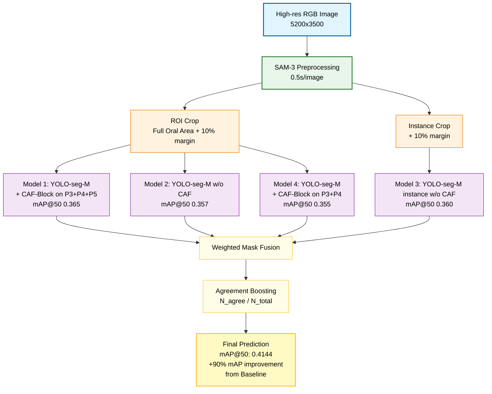

# TeethSegmentation — Kaggle 1st Place (27 Teams)

## Problem

This project was developed for the **AlphaDent: Teeth Marking** Kaggle competition, which focuses on the precise identification and segmentation of dental pathologies. In modern dentistry, detecting dental caries (cavities) remains a significant challenge due to their **microscopic scale** and **highly irregular morphologies**, making manual diagnosis a time-consuming and labor-intensive process for clinicians. 

To address these hurdles, this repo addresses a robust deep learning pipeline for **pixel-level detection and segmentation**, serving as a **Diagnostic Decision Support System (DDSS)**. By automating the identification of lesions at various stages, this system enables early detection of pathologies and assists clinicians in formulating rapid, data-driven treatment strategies.

- Competition Link: https://www.kaggle.com/competitions/alpha-dent


## Dataset

The dataset comprises high-resolution RGB intraoral photographs (averaging **5200 x 3500 pixels**) from **293 patients**, totaling **1,459 images** annotated in the YOLO polygon format. The data captures a wide range of clinical scenarios, including frontal views, lateral views, and mirror-reflected captures, providing a diverse set of perspectives for the model to learn from.

The annotations are categorized into **9 distinct classes** (Abrasion, Filling, Crown, and Caries Stages 1–6), which are subdivided based on caries progression, anatomical location, and morphological characteristics. On average, each image contains **9 dental instances**, presenting a dense and challenging environment for precise instance segmentation.

- Visualization per Class: https://drive.google.com/drive/folders/1M453t0YtOpvSc_spN75RlAdduSGMMUFS

## Pipeline Architecture



## Ablation Study
### Confidence Threshold Optimization
| Conf Threshold | test mAP@50 | Avg. Detections per Image |
| :--- | :---: | :---: |
| 0.25 (Default) | 0.300 | 11.7 |
| 0.15 | 0.328 | 17.6 |
| 0.02 | 0.356 | 25.1 |
| **0.01** | **0.360** | **31.3** |

### NWD Loss
| NWD Weight ($\alpha$)| CIoU Weight (1 - $\alpha$) | Test mAP@50 | Improvement |
| :--- | :---: | :---: | :---: | 
| 0 | 1 (YOLO default) |0.266 | - | 
| 0.5 | 0.5 | 0.278 | +0.012 | |
| **0.6 (Optimal)** | **0.4** | **0.300** | **+0.034** | |
| 0.7 | 0.3 | 0.248 | -0.018 | |
| 0.8 | 0.2 | 0.289 | +0.023 | |

### CAF-Block

| Insertion Layer | Internal Components | $\alpha$ | Test mAP@50 | Notes |
| :--- | :--- | :---: | :---: | :--- |
| P3 | **MSNN + ACFM** | 1.0 | 0.304 | Baseline (P3) |
| P4 | **MSNN + ACFM** | 1.0 | 0.339 | Significant jump at P4 |
| P5 | **MSNN + ACFM** | 1.0 | 0.323 | Performance degradation |
| P4 | ACFM Only | 1.0 | 0.297 | Local-attention only |
| P4 | MSNN Only | 1.0 | 0.312 | Multi-scale FFN only |
| P4 | **MSNN + ACFM** | 0.1 | 0.317 | Low integration |
| P4 | **MSNN + ACFM** | 0.3 | 0.328 | Moderate integration |
| P4 | **MSNN + ACFM** | **0.5** | 0.346 | Optimal P4 Configuration |
| P4 | **MSNN + ACFM** | 0.7 | 0.339 | Over-saturation |
| P3 + P4 | MSNN + ACFM | **0.5** | 0.355 | Dual-layer fusion |
| **P3+P4+P5** | **MSNN + ACFM** | **0.5** | **0.365** | **Best Performance (Final)** |

## Results


## How to Run

### 1. Environment Setup
First, create a virtual environment and install the required dependencies.

```bash
# Create and activate a conda environment
conda create -n teeth python=3.11 -y
conda activate teeth

# Clone the repository
git clone https://github.com/hyun-ko-DS/TeethSegmentation.git
cd TeethSegmentation

# Install dependencies
pip install -r requirements.txt
```

### 2. Data Preparation
You can either download the raw data and process it locally or download the already preprocessed data from Google Drive.

#### Option A: Full Pipeline (Download & Preprocess)
```bash
# Step 1: Download raw AlphaDent dataset from Hugging Face
python loader.py

# Step 2: Run SAM-3 Preprocessing (ROI or Instance mode)
python sam3_preprocessing.py --mode roi --split train
python sam3_preprocessing.py --mode instance --split valid
```

#### Option B: Quick Start (Download Preprocessed Data)
If you want to skip the SAM-3 processing time, download the pre-processed crops directly from GDrive.
```bash
python sam3_preprocessing.py --from_drive
```

### 3. Training
Start training with the specialized CAF-Block and NWD loss configuration.

> **Disclaimer:** The `config.json` and `best.pt` files required for training are not included in this repository due to file size limits. Please contact **hyunko954@gmail.com** for access to the download links.

#### Option A: Train from scratch
```bash
python train.py --mode train --model_name model_365
python train.py --mode train --model_name model_360
python train.py --mode train --model_name model_357
python train.py --mode train --model_name model_355
```
#### Option B: Load best.pt from GDrive

```bash
python train.py --mode from_drive --model_name model_365
python train.py --mode from_drive --model_name model_360
python train.py --mode from_drive --model_name model_357
python train.py --mode from_drive --model_name model_355
```

### 4. Ensemble & Inference
Generate the final submission for the leaderboard.
```bash
# For validation check
python ensemble.py --data valid

# For final submission.csv
python ensemble.py --data test
