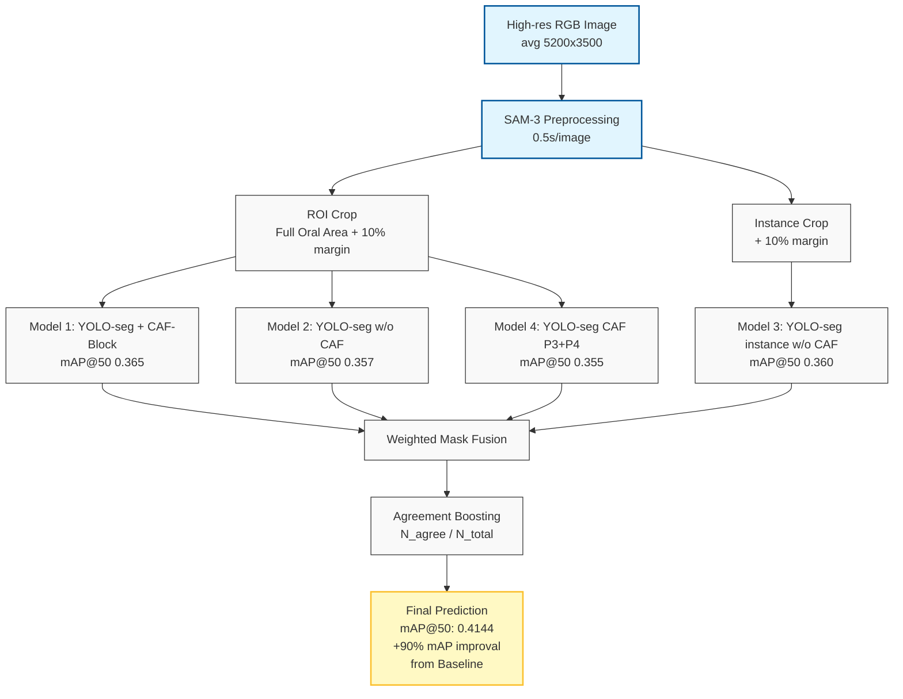

# TeethSegmentation — Kaggle 1st Place (27 Teams)

## Problem

## Dataset

## Pipeline Architecture



## Key Techniques


## Ablation Study
### Confidence Threshold Optimization
| Conf Threshold | test mAP@50 | Avg. Detections per Image |
| :--- | :---: | :---: |
| 0.25 (Default) | 0.300 | 11.7 |
| 0.15 | 0.328 | 17.6 |
| 0.02 | 0.356 | 25.1 |
| **0.01** | **0.360** | **31.3** |

**Analysis:** Setting a lower confidence threshold (0.01) allowed the model to detect small or partially obscured teeth that were previously ignored. This resulted in an average of 31.3 detections per image, which closely aligns with the biological ground truth of human dentition, leading to our highest mAP of **0.360** for a single model.

### NWD Loss
| NWD Weight ($\alpha$)| CIoU Weight (1 - $\alpha$) | Test mAP@50 | Improvement |
| :--- | :---: | :---: | :---: | 
| 0 (YOLO default) | 1 |0.266 | - | 
| 0.5 | 0.5 | 0.278 | +0.012 | |
| **0.6 (Optimal)** | **0.4** | **0.300** | **+0.034** | |
| 0.7 | 0.3 | 0.248 | -0.018 | |
| 0.8 | 0.2 | 0.289 | +0.023 | |

**Analysis:** Integrating NWD significantly outperformed the standard CIoU-only baseline. At **$\alpha=0.6$**, the model achieved its peak performance of **0.300**, effectively addressing the challenges of detecting small, overlapping teeth where traditional IoU gradients often vanish.

### CAF-Block

| Insertion Layer | Internal Components | $\alpha$ | Test mAP@50 | Notes |
| :--- | :--- | :---: | :---: | :--- |
| P3 | MSNN + ACFM | 1.0 | 0.304 | Baseline (P3) |
| P4 | MSNN + ACFM | 1.0 | 0.339 | Significant jump at P4 |
| P5 | MSNN + ACFM | 1.0 | 0.323 | Performance degradation |
| P4 | ACFM Only | 1.0 | 0.297 | Local-attention only |
| P4 | MSNN Only | 1.0 | 0.312 | Multi-scale FFN only |
| P4 | MSNN + ACFM | 0.1 | 0.317 | Low integration |
| P4 | MSNN + ACFM | 0.3 | 0.328 | Moderate integration |
| **P4** | **MSNN + ACFM** | **0.5** | **0.346** | **Optimal P4 Configuration** |
| P4 | MSNN + ACFM | 0.7 | 0.339 | Over-saturation |
| P3 + P4 | MSNN + ACFM | 0.5 | 0.355 | Dual-layer fusion |
| **P3+P4+P5 (Ours)** | **MSNN + ACFM** | **0.5** | **0.365** | **Best Performance (Final)** |

## Results


## How to Run

### 1. Environment Setup
First, create a virtual environment and install the required dependencies.

```bash
# Create and activate a conda environment
conda create -n teeth python=3.11 -y
conda activate teeth

# Clone the repository
git clone https://github.com/hyun-ko-DS/TeethSegmentation.git
cd TeethSegmentation

# Install dependencies
pip install -r requirements.txt
```

### 2. Data Preparation
You can either download the raw data and process it locally or download the already preprocessed data from Google Drive.

#### Option A: Full Pipeline (Download & Preprocess)
```bash
# Step 1: Download raw AlphaDent dataset from Hugging Face
python loader.py

# Step 2: Run SAM-3 Preprocessing (ROI or Instance mode)
python sam3_preprocessing.py --mode roi --split train
python sam3_preprocessing.py --mode instance --split valid
```

#### Option B: Quick Start (Download Preprocessed Data)
If you want to skip the SAM-3 processing time, download the pre-processed crops directly from GDrive.
```bash
python sam3_preprocessing.py --from_drive
```

### 3. Training
Start training with the specialized CAF-Block and NWD loss configuration.

#### Option A: Train from scratch
```bash
python train.py --mode train --model_name model_365
python train.py --mode train --model_name model_360
python train.py --mode train --model_name model_357
python train.py --mode train --model_name model_355
```
#### Option B: Load best.pt from GDrive

```bash
python train.py --from_drive
```

### 4. Ensemble & Inference
Generate the final submission for the leaderboard.
```bash
# For validation check
python ensemble.py --data valid

# For final submission.csv
python ensemble.py --data test
